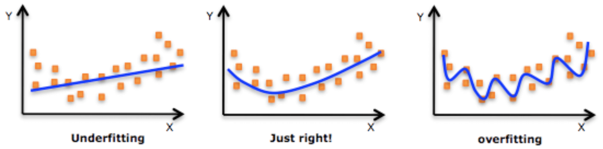
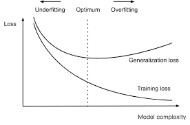

# Core Concepts of ML

Before coding, I'd like to introduce some core concepts of Machine Learning to you first. When it comes to machine learning, these concepts appear everywhere. 

### Supervised vs Unsupervised

* supervised: There are input variables and output variable(label)
* unsupervised:  We only have input variables without label. 

### Classification vs Regression

**Both of them are supervised learning**. If the output variable is quantitive (GDP or house price), it's a regression problem while if the output variable is qualitive(spam or not, cancer or not), it should be a classification problem. 

### Loss Function

Loss function is the most important concept in ML. Defining a good and suitable loss function has a huge effect on training and prediction. The loss function $L(Y,\hat{f}(x))$ measures the errors between the observed value $Y$ and the predicted value $\hat{f}(X)$. **Loss function is varying from different kinds of problems**. For example, squared loss which is usually used for regression problem looks like: $L(Y,\hat{f}(x))= (Y - \hat{f}(x))^2$ while 0-1 loss which is often used in classification is defined as  $L(Y,\hat{f}(x))= I(Y \neq \hat{f}(x))$.

*[Placeholder] Later I would make a table to summarize some widely-used loss functions in ML, including their forms, use scenarios, pros and cons, comparison with others*.

### Bias and Variance Trade-off

This concept goes like: 

$MSE(X) = E(Y-\hat{f}(x))^2 = (Bias(\hat{f}(x)))^2 + var(\hat{f}(x)) + noise$

Why? Let‘s do some derivations. Of course, if you're not comfortable with mathematics, you could skip the derivative part and go to the summary directly. 

* something we have: $Y=\hat{f}(x)+\epsilon$，where $Y$ is the observed value and $\hat{f}(x)$ is estimated function . And as we always assume, $E(\epsilon) = 0$ and $var(\epsilon) = \sigma^2$. Note: $E(Y) = Y = E(\hat{f}(x))$

$$
\begin{align*}
MSE(X) &= E(Y-\hat{f})^2 \\
			 &= E(Y - E(\hat{f}) + E(\hat{f}) - \hat{f})^2 \\
       &= E(Y - E(\hat{f}))^2 + E(E(\hat{f}) - \hat{f})^2 + 2E[(Y - E(\hat{f}))(E(\hat{f}) - \hat{f})] \\
       &= E(Y - E(\hat{f}))^2 + E(E(\hat{f}) - \hat{f})^2 + 2[YE(\hat{f}) - YE(\hat{f}) - E(\hat{f})^2 + E(\hat{f})^2] \\
       &= E(Y - E(\hat{f}))^2 + E(E(\hat{f}) - \hat{f})^2 + 0 \\
       &= E(Y - E(\hat{f}))^2 + E(E(\hat{f}) - Y + Y- \hat{f})^2 \\
       &= E(Y - E(\hat{f}))^2 + E(E(\hat{f}) - Y)^2 + E(Y- \hat{f})^2 + 2E[(E(\hat{f}) - Y)(Y- \hat{f})] \\
       &= E(Y - E(\hat{f}))^2 + (E(\hat{f}) - Y)^2 + var(\epsilon) + 0 \\
       &= var(\hat{f}) + bias^2 + noise
\end{align*}
$$

Based on this deduction above, we could see that when we decrease the bias beyond some point, we increase the variance, and vice-versa. Their relationship could be described as below:

In one word, **More flexibility = Higher variance = Lower bias**. 

### Underfitting vs Overfitting

Before classifying underfitting and overfitting, we have to know training and test loss first. Training loss is the loss computed on training dataset while test loss is the one measured on test dataset. 

* Underfitting is the situation where model does not fit training dataset well. That is to say, training loss is large. (**low variance, high bias**)

* Overfitting shows that model fits every points in training dataset with 100% accuracy while it performs badly on test data. That means, training loss is really low but test loss is large.  (**low bias, high variance**)

  

  See! It's just another version of variance-bias trade off! All of these things could be summarized in one plot as below:

  

